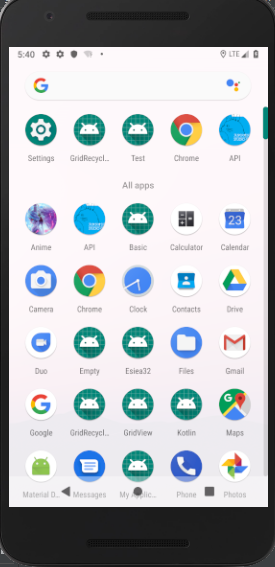
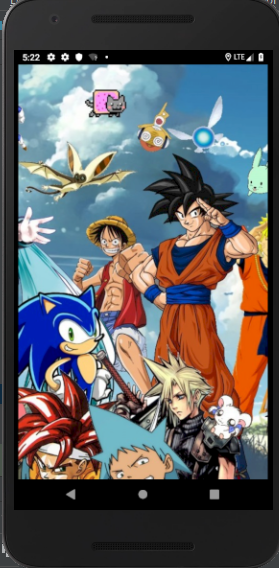
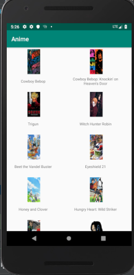
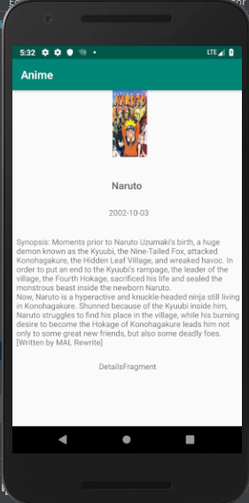

# Projet_Mobile
Ce projet a été réalisé ddans le but d'apprendre des choses en programmation mobile. L'objectif était de créer une application Android 
codé sur Android Studio.
Cette application affiche une liste de manga et utilise l'API trouvé sur 
https://kitsu.docs.apiary.io/#introduction/json-api/filtering-and-search

## Présentation
Ce projet est une application mobile récupérant des données d'une grande API (lien au dessus) de manga. Cette API permet d'avoir récupérer
certaines données de manga comme les personnages, les synopsis, les notes, etc...
Cette API me sert pour avoir une liste de mangas ainsi que les images de leur couverture. 
J'utilise Picasso sur Android Studio pour charger les liens d'image sur l'API.

## Fonctionnalités

- Codé en Java (Bien que l'idée de départ était de réaliser le projet en Kotlin pour changer de langage.
- SplashScreen
- Architecture MVVM pour apprendre une autre que le projet d'avant
- Utilisation de fragment (J'ai créé un fragment mais je n'arrivais pas à mettre ce que je voulais dedans et à l'utiliser comme
je le voulais dans mon projet.
- Utilisation de Picasso pour les Images
- J'ai essayé de faire plusieurs appel API pour avoir la liste des autres mangas mais rajouter ensuite les données de l'appel
dans la première liste était compliqué. 

- Icone de lancement

On peut voir ici l'icone au dessus du nom de l'application du projet: "Anime"

- Splash Screen

- Ecran d'accueil

- Ecran de détails

